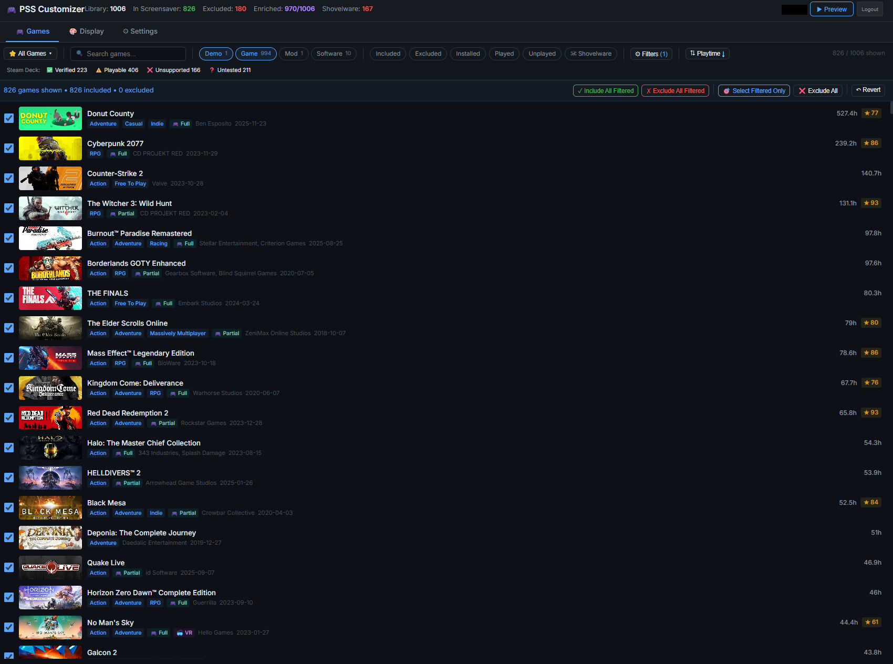
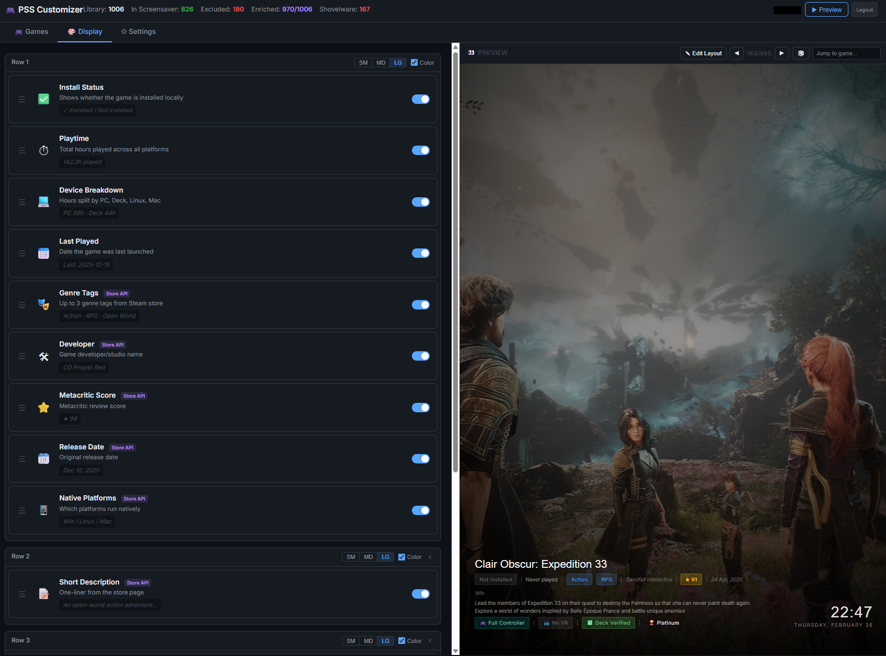
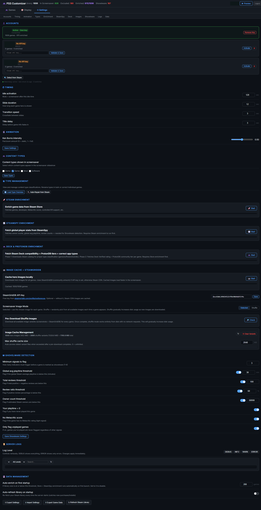
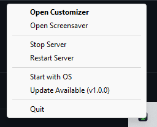

# PSS — Plexified Steam Screensaver

A cinematic Ken Burns slideshow screensaver for your Steam game library, with a full web-based customizer UI.

   

<p align="center">
  
</p>

<p align="center">
  
  
</p>

<p align="center">
  
  
</p>

---

## Quick Start

### Windows — Download and Double-Click

1. Go to [**Releases**](https://github.com/Rayce185/PlexifiedSteamScreensaver/releases/latest)
2. Download `PSS-Windows-vX.X.X.zip`
3. Extract the ZIP anywhere (Desktop, Documents, wherever)
4. Double-click **`PSS.exe`**

That's it. No Python. No command line. No installs.

- A **system tray icon** appears in your taskbar (bottom-right, near the clock)
- Your browser opens to the setup page
- Enter your **Steam Web API Key** when prompted ([get one here](https://steamcommunity.com/dev/apikey))
- Done — PSS is running

### Linux — Download and Run

1. Go to [**Releases**](https://github.com/Rayce185/PlexifiedSteamScreensaver/releases/latest)
2. Download `PSS-Linux-vX.X.X.tar.gz`
3. Extract and run:

```bash
tar xzf PSS-Linux-*.tar.gz
./PSS/PSS
```

No Python install needed — everything is bundled.

> **Alternative (from source):** If you prefer using your system Python:
> ```bash
> wget https://github.com/Rayce185/PlexifiedSteamScreensaver/releases/latest/download/PSS-Source-vX.X.X.zip
> unzip PSS-Source-*.zip && cd PSS-Source
> bash pss.sh
> ```
> Requires Python 3.11+ (`sudo apt install python3 python3-pip`)

### After Launch

| Action | What happens |
|--------|-------------|
| **Double-click tray icon** | Opens the Customizer UI in your browser |
| **Right-click tray icon** | Start / Stop / Restart / Auto-start with OS / Check for Updates / Quit |
| First run | Browser opens setup page → enter Steam API key → library loads automatically |

---

## What You Need

| Requirement | Windows .exe | Linux binary | Source |
|-------------|:---:|:---:|:---:|
| **Python 3.11+** | Bundled ✓ | Bundled ✓ | Install separately |
| **Steam** | ✓ Installed | ✓ Installed | ✓ Installed |
| **Steam Web API Key** | Prompted on first run | Prompted on first run | Prompted on first run |
| **SteamGridDB Key** *(optional)* | Settings UI | Settings UI | Settings UI |

> **Steam Web API Key**: [steamcommunity.com/dev/apikey](https://steamcommunity.com/dev/apikey) — log in, enter "localhost" as domain, copy the key.
> **SteamGridDB Key** *(optional, for better images)*: [steamgriddb.com/profile/preferences/api](https://www.steamgriddb.com/profile/preferences/api)

---

## Features

### Screensaver
- **Ken Burns slideshow** — 8 animation variants with configurable intensity and timing
- **Multi-row display elements** — 14+ data badges across configurable rows with per-row sizing (SM/MD/LG) and color/mono modes
- **WYSIWYG layout editor** — drag game info and clock overlays anywhere on screen via the Display tab
- **Image shuffle mode** — random images per game appearance from screenshots, SteamGridDB, and headers

### Library Management
- **Multi-account support** — auto-detects all Steam accounts, hot-switches without restart
- **Per-account API keys** — each Steam account stores its own API key
- **Complete library coverage** — Steam API v1 + local manifest scan for tools/software not in API
- **Presets, filters, sorting** — type, genre, installed, played, enriched, NSFW, shovelware, Deck status
- **Bulk include/exclude** — with undo snapshots
- **Shovelware detection** — configurable 6-signal scoring
- **NSFW auto-detection** — auto-excludes explicit content from screensaver pool

### Enrichment Pipeline
- **Steam Store** — genres, developer, metacritic, controller/VR support, descriptions, screenshots
- **SteamSpy** — owner counts, global avg playtime, review counts
- **Steam Deck + ProtonDB** — Valve's official Deck compatibility + community Proton tier
- **SteamGridDB image cache** — hero images with 16:9 aspect ratio filtering
- **Type correction** — proper app classification from Steam's authoritative catalog

### Image System
- **Per-game image picker** — choose from cached images, SGDB alternatives, screenshots, or upload custom
- **Shuffle mode** — random image each appearance, with batch pre-download option
- **Cache management** — size tracking, auto-cleanup at configurable limit

### System
- **Steam OpenID authentication** — only your Steam accounts can access the customizer
- **System tray app** — start/stop/restart from taskbar, auto-start with OS
- **WebSocket live updates** — real-time progress for all enrichment workers
- **Dynamic log level** — DEBUG/INFO/WARNING/ERROR changeable at runtime
- **Searchable log viewer** — built into Settings UI

---

## Updating

### Windows (.exe)
Right-click the tray icon → **Check for Updates**. If a new version is available, it opens the download page. Download the new ZIP, extract over the old folder — your `data/` directory is preserved.

### Linux / macOS (source)
```bash
./update.sh    # backs up data, downloads latest, restores data
```

### From Source (git)
```bash
git pull origin main
pip install -r requirements.txt
```

---

## First Run

On first launch the server will:
1. Create the SQLite database in `data/pss.db`
2. Detect your Steam account(s) from `loginusers.vdf`
3. Fetch your game library from Steam API
4. Scan local manifests for installed tools/software

Open in browser:
- **Customizer**: http://localhost:8787/customizer
- **Screensaver**: http://localhost:8787/screensaver

### Enrichment (recommended)

In the customizer, go to **Settings** and run enrichment in order:

1. **Steam Store Enrichment** — genres, developer, metacritic, controller/VR (~25 min / 1000 games)
2. **SteamSpy Enrichment** — owner counts, playtime stats, reviews (~4 min / 1000 games)
3. **Deck & ProtonDB Enrichment** — Deck compat, ProtonDB tier, type correction (~7 min / 1000 games)
4. **SteamGridDB Image Cache** — hero image alternatives (requires SGDB API key)


## System Tray

PSS includes a system tray application that sits in your taskbar (Windows) or panel (Linux).
Double-click the tray icon to open the Customizer. Right-click for the full menu.

### Running from Source

```bash
# Windows (no console window — .pyw extension)
pythonw pss_tray.pyw

# Linux
python3 pss_tray.pyw
```

### Tray Menu

- **Open Customizer** (double-click) — opens `http://localhost:8787/customizer`
- **Open Screensaver** — opens the fullscreen screensaver
- **Start / Stop / Restart Server** — manage the server process
- **Start with OS** — toggle auto-launch at login (Windows: Startup folder shortcut, Linux: XDG autostart)
- **Check for Updates** — checks GitHub for new releases, opens download page if available
- **Quit** — stops the server and exits the tray

### Icon States

| Icon Color | Meaning |
|------------|---------|
| Green | Server running |
| Yellow | Starting / Restarting |
| Gray | Stopped |

Launch with `--no-server` to start the tray without auto-starting the server:

```bash
pythonw pss_tray.pyw --no-server
```

## Running as a Background Service (Headless / No Desktop)

PSS includes service managers for both platforms. These handle auto-start on boot,
background execution, and clean start/stop lifecycle.

### Windows

```powershell
.\pss-service.ps1 install    # Register auto-start at logon (uses pythonw, no console)
.\pss-service.ps1 start      # Start now
.\pss-service.ps1 status     # Show PID, uptime, memory
.\pss-service.ps1 stop       # Stop the server
.\pss-service.ps1 restart    # Stop + start
.\pss-service.ps1 uninstall  # Remove auto-start and stop
```

Uses Task Scheduler with `pythonw.exe` (no console window). Restarts automatically
up to 3 times on failure with 1-minute intervals.

### Linux

```bash
./pss-service.sh install    # Create systemd unit, enable on boot
./pss-service.sh start      # Start now
./pss-service.sh status     # Show PID, uptime, memory
./pss-service.sh stop       # Stop the server
./pss-service.sh restart    # Stop + start
./pss-service.sh logs       # Follow live journal output
./pss-service.sh uninstall  # Remove service and stop
```

Creates a hardened systemd service with `Restart=on-failure`, `NoNewPrivileges`,
`PrivateTmp`, and `ProtectSystem=strict`.

### Foreground Mode

For debugging or development, use the interactive launchers:

```powershell
.\Start-PSS.ps1    # Windows — console with colored output
./start.sh          # Linux/macOS — terminal with browser auto-open
```

## API Reference

### Library & Games
| Method | Path | Description |
|--------|------|-------------|
| GET | `/api/games` | Full game library (merged with enrichment) |
| POST | `/api/refresh-library` | Re-fetch from Steam API |
| GET | `/api/excluded` | Excluded appid list |
| POST | `/api/excluded` | Update exclusion list |
| POST | `/api/toggle-exclusion` | Toggle single game |
| POST | `/api/bulk-exclusion` | Bulk include/exclude |
| POST | `/api/exclusion-snapshot` | Save exclusion state |
| GET | `/api/exclusion-snapshots` | List saved states |
| POST | `/api/exclusion-restore/{id}` | Restore saved state |
| GET | `/api/filter-values` | Distinct filterable values |
| POST | `/api/repair-types` | Re-run type correction |

### Accounts & Auth
| Method | Path | Description |
|--------|------|-------------|
| GET | `/api/accounts` | All detected accounts |
| GET | `/api/accounts/active` | Current active account |
| GET | `/api/accounts/detect` | Re-scan loginusers.vdf |
| POST | `/api/accounts/switch` | Switch active account |
| POST | `/api/accounts/{id}/api-key` | Set per-account API key |
| DELETE | `/api/accounts/{id}/api-key` | Remove per-account API key |
| DELETE | `/api/accounts/{id}` | Delete account and all data |
| GET | `/api/auth/steam/login` | Steam OpenID login |
| GET | `/api/auth/steam/callback` | OpenID callback |
| GET | `/api/auth/status` | Session status |
| POST | `/api/auth/logout` | Logout |

### Enrichment Workers
| Method | Path | Description |
|--------|------|-------------|
| POST | `/api/enrichment/start` | Start Store enrichment |
| GET | `/api/enrichment/status` | Store enrichment progress |
| POST | `/api/enrichment/stop` | Stop Store enrichment |
| POST | `/api/steamspy/start` | Start SteamSpy enrichment |
| GET | `/api/steamspy/status` | SteamSpy progress |
| POST | `/api/steamspy/stop` | Stop SteamSpy |
| POST | `/api/deck/start` | Start Deck/ProtonDB enrichment |
| GET | `/api/deck/status` | Deck enrichment progress |
| POST | `/api/deck/stop` | Stop Deck enrichment |
| POST | `/api/cache/start` | Start SGDB image cache |
| GET | `/api/cache/status` | Image cache progress |
| POST | `/api/cache/stop` | Stop image cache |

### Images
| Method | Path | Description |
|--------|------|-------------|
| GET | `/api/image/{appid}/hero` | Serve hero image |
| GET | `/api/image/{appid}/options` | All image alternatives |
| GET | `/api/image/{appid}/random` | Random image (shuffle) |
| POST | `/api/image/{appid}/select` | Select specific image |
| POST | `/api/image/{appid}/upload` | Upload custom image |
| GET | `/api/shuffle-cache/estimate` | Pre-download size estimate |
| POST | `/api/shuffle-cache/start` | Start shuffle pre-download |
| GET | `/api/shuffle-cache/status` | Pre-download progress |
| POST | `/api/shuffle-cache/stop` | Stop pre-download |
| GET | `/api/shuffle-cache/size` | Cache disk usage (heroes + variants) |
| POST | `/api/shuffle-cache/clear` | Delete all shuffle variant files |

### Configuration & System
| Method | Path | Description |
|--------|------|-------------|
| GET | `/api/config` | Full configuration |
| POST | `/api/config` | Update config keys |
| GET | `/api/presets` | Saved filter presets |
| POST | `/api/presets` | Create/update preset |
| DELETE | `/api/presets/{id}` | Delete preset |
| GET | `/api/logs` | Log viewer (tail/filter/search) |
| POST | `/api/logs/level` | Change log level at runtime |
| WS | `/ws` | WebSocket for real-time worker updates |

## Project Structure

```
PSS/
├── pss/
│   ├── __init__.py
│   ├── database.py          # SQLite schema v5 + migrations + queries
│   └── server.py            # FastAPI server, workers, auth, all API
├── web/
│   ├── screensaver.html     # Ken Burns slideshow (multi-row, shuffle)
│   ├── customizer.html      # 3-tab config UI (Games/Display/Settings)
│   ├── login.html           # Steam OpenID login page
│   └── setup.html           # First-run account detection
├── data/                    # SQLite database + image cache (gitignored)
├── logs/                    # Server logs with archive (gitignored)
├── pss_tray.pyw             # ⭐ Main app: system tray + server management
├── pss.spec                 # PyInstaller spec → builds PSS.exe
├── .github/workflows/       # GitHub Actions: auto-build .exe on release
├── PSS.bat                  # Windows source launcher (fallback if no .exe)
├── pss.sh                   # Linux/macOS source launcher
├── Install-PSS.ps1          # Windows manual setup (PowerShell)
├── Start-PSS.ps1            # Windows foreground/debug launcher
├── Update-PSS.ps1           # Windows source updater
├── pss-service.ps1          # Windows headless service (Task Scheduler)
├── install.sh               # Linux/macOS manual setup
├── start.sh                 # Linux/macOS foreground/debug launcher
├── update.sh                # Linux/macOS source updater
├── pss-service.sh           # Linux headless service (systemd)
├── migrate_v2.py            # One-time JSON → SQLite migration (v2 users)
├── requirements.txt
├── .env.example
├── VERSION                  # Version tag or commit hash
└── .gitignore
```

## Database Schema

SQLite with 5 schema versions, auto-migrating on startup:
- **accounts** — Steam accounts with persona names and API keys
- **games** — core library (appid, name, type, playtime, installed status)
- **enrichment** — Store/SteamSpy/Deck data per game
- **image_cache** — SGDB image metadata with selection tracking
- **display_elements** — per-account element ordering with multi-row support
- **config** — key-value config with scoping (global, per-account)
- **presets** — saved filter/sort combinations
- **exclusion_snapshots** — undo history for bulk operations

## License

MIT
